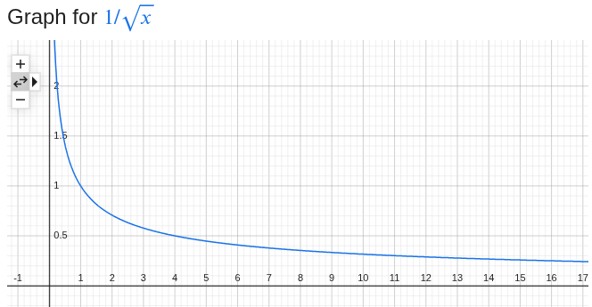
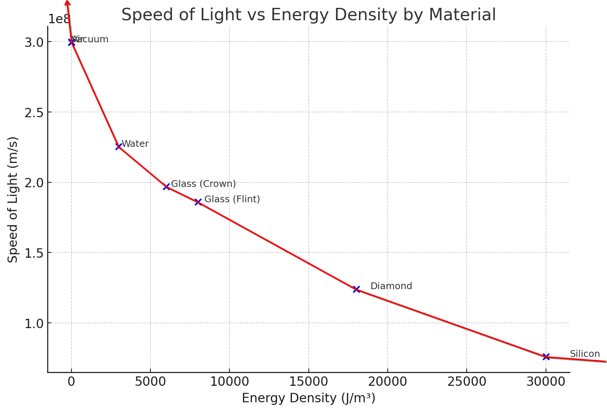

# Fast-Light in Voids and the Young Universe

People often say, that the Universe can't be young, or about 6 000 years old as the plane Bible reading suggests, because the light wouldn't have had time to reach us from the Galaxies that are billions of light years away if light travells at about 300 000 000 or 3e8 m/s.

But:
- Light speed in the vacuum of deep space has never been directly measured, but was **assumed** it remains 3e8 m/s as we see it in our solar system
- Electromagnetic formula shows light speed will increase dramaticly as the Resistance of the medium drops even slightly
- The real observations suggest Resistance is related to Energy Density of the medium - the speed of light grows rapidly as the Energy Density of the substance it passes thorugh drops
- If the Energy Density of deep space is even slightly lower than what we measure in our solar system (as expected/observed - less stuff in the voids), the speed of light would rapidly increase in it, shooting up to infinity very rapidly as the density approaches 0, making the light traverse the vast expances of deep space almost instantly

Young Universe + Fast-Light in Voids naturally explains:
- Why Galaxies look the same no matter how far we look with telescopes like Hubble and JWST. Why don't we see younger/proto galaxies billions of light years away? - because they were not created billions of years ago, but were all created recently
- No need to invent "dark matter" to keep the Galaxies stable billions of years for the light to reach us - it reaches us almost instantly

---

## Electromagnetic formula for light

The physical formula for the speed of light in vacuum (`c`) from electromagnetism is:

`c = 1 / sqrt(μ * ε)`

Where:  
- `μ` = vacuum permeability  
- `ε` = vacuum permittivity  

Lets call `μ * ε = R` (**R**: space light speed **Resistance**, since `μ` and `ε` are codependent), then:

`c = 1 / sqrt(R)`

`μ` and `ε` (or `R`) have been measured in our local space but have been assumed to be the same in deep space.

But here is how `c`would change if `R` is different.

=> Electromagnetic formula shows light speed will increase dramaticly as the Resistance of the medium drops even slightly

---

## Speed of light observations

The speed of light grows rapidly as the Energy Density of the substance it passes through decreases, similarly to the relation `c = 1 / sqrt(R)`, so `Resistance ~ Energy Density`

| Substance       | Speed of Light (m/s) | Energy Density (J/m³)  |
|-----------------|----------------------|------------------------|
| Vacuum          | 299,792,458          | 6.91 × 10⁻¹⁰           |
| Air             | 299,702,547          | 1.3                    |
| Water           | 225,407,863          | 3,000.0                |
| Glass (Crown)   | 197,000,000          | 6,000.0                |
| Glass (Flint)   | 186,000,000          | 8,000.0                |
| Diamond         | 124,000,000          | 18,000.0               |
| Silicon         | 76,000,000           | 30,000.0               |

=> The real observations suggest Resistance is related to Energy Density of the medium - the speed of light grows rapidly as the Energy Density of the substance it passes thorugh drops

=> If the Energy Density of deep space is even slightly lower than what we measure in our solar system (as expected/observed - less stuff in the voids), the speed of light would rapidly increase in it, shooting up to infinity very rapidly as the density approaches 0, making the light traverse the vast expances of deep space almost instantly