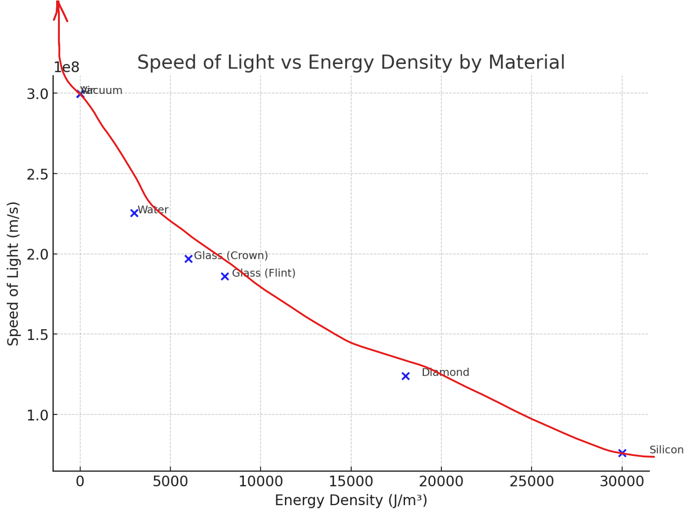

# 🌌 Fast-Light in Voids: A Young Universe Perspective

## Summary

This theory proposes that **light travels much faster** through **cosmic voids** — vast, ultra-low-energy-density regions of space, as hinted by real observations `c = 1 / sqrt(R)`

| Substance       | Speed of Light (m/s) | Energy Density (J/m³) |
|----------------|----------------------|------------------------|
| Vacuum         | 299,792,458          | 6.91 × 10⁻¹⁰           |
| Air            | 299,702,547          | 1.3                    |
| Water          | 225,407,863          | 3,000.0                |
| Glass (Crown)  | 197,000,000          | 6,000.0                |
| Glass (Flint)  | 186,000,000          | 8,000.0                |
| Diamond        | 124,000,000          | 18,000.0               |
| Silicon        | 76,000,000           | 30,000.0               |

It resolves the **distant starlight problem** for a young (~6,000-year) universe by using well-known electromagnetic relationships, without invoking exotic “dark” substances.

---

## 🧠 Key Points

- **High-speed light in cosmic voids**  
  - Vacuum impedance `R = μ * ε` is lower in cosmic voids than locally.
  - Since `c = 1/sqrt(R)`, a lower `R` means a higher light speed.
  - Allows light from objects that appear billions of light-years away to reach us within thousands of years.

- **No causality paradoxes**  
  - In a universe with **absolute creation time**, higher local `c` values do not cause time-travel contradictions.

- **Galaxies look mature at all distances**  
  - JWST and Hubble have found large, stable, mature galaxies at high redshift (`z > 6`), when the standard model says they should look primitive.
  - In this model, short look-back times explain the lack of “younger” galaxies.

- **Dark matter problem reduced or eliminated**  
  - In ΛCDM, high rotation speeds over billions of years require massive unseen halos.
  - In this model, galaxy stability is considered over thousands of years — making the need for huge invisible halos vanish or shrink.

---

## 🔬 Physics Basis

From electromagnetism:

`c = 1 / sqrt(μ * ε)`

Where:  
- `μ` = vacuum permeability  
- `ε` = vacuum permittivity  
- Let `R = μ * ε` (**vacuum impedance term**)

Then:

`c = 1 / sqrt(R)`

- If `R` falls in low-energy-density voids, `c` rises sharply.  
- No “new physics” is invented — we reinterpret known constants as environmental variables.

---

## 📉 Redshift in This Model

- As `c` increases in voids, wavelength `λ` increases for constant `f` → **redder light** in transit.
- Space contains a sparse distribution of particles/fields:
  - Cumulative tiny **energy loss per distance**:  
    `α = H0 / c0 ≈ 7.57 × 10^-27 m^-1`  
    (≈ 0.023% per Mpc or 7.16 × 10^-11 per light-year)
  - Matches observed Hubble slope without expansion.
- Dimming = inverse-square geometry + small cumulative energy loss — not acceleration.

---

## 📊 Observational Fits

- **Mature galaxies** at all redshifts → expected due to short real travel times.
- **No dark energy needed** — the “acceleration” signal from Type Ia supernovae is reinterpreted as a propagation/energy-loss effect.
- **No (or minimal) dark matter needed** — stability over thousands of years doesn’t require huge invisible halos.
- **Redshift–distance relation** comes from medium properties, not space expansion.

---

## 📌 Predictions

1. Deep voids may reveal indirect signs of high-`c` propagation (timing anomalies, frequency shifts).
2. Galaxy morphology and metallicity distributions will remain uniform across redshift.
3. Observed “age” discrepancies at high `z` will persist — standard model will keep finding “too old” galaxies.

---

## ✝️ For Biblical Believers

- Provides a physics-based mechanism consistent with a **literal 6-day creation** and a **~6,000-year** Earth age.
- Explains how distant starlight could be visible on Day 4 without violating causality.

---

## ✅ Summary Line

> **Variable vacuum impedance in cosmic voids → higher `c` → short real travel times + small energy loss → observed redshift and dimming without dark energy or dark matter.**
